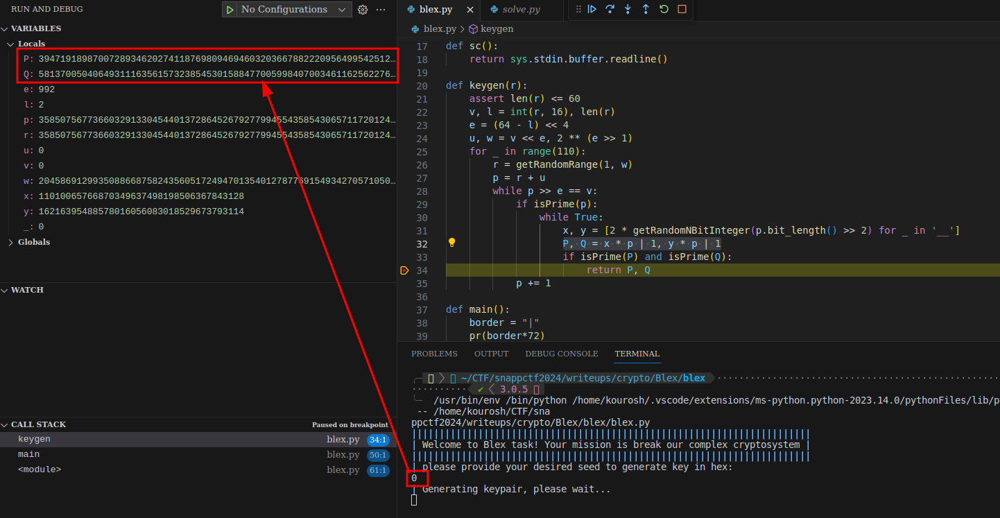
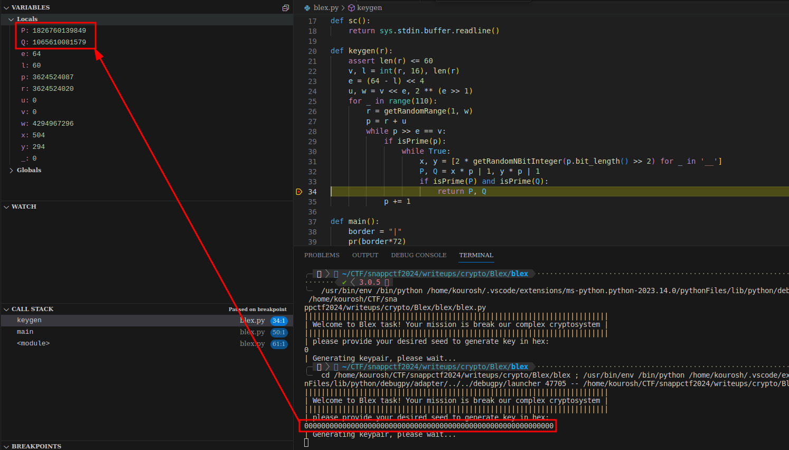
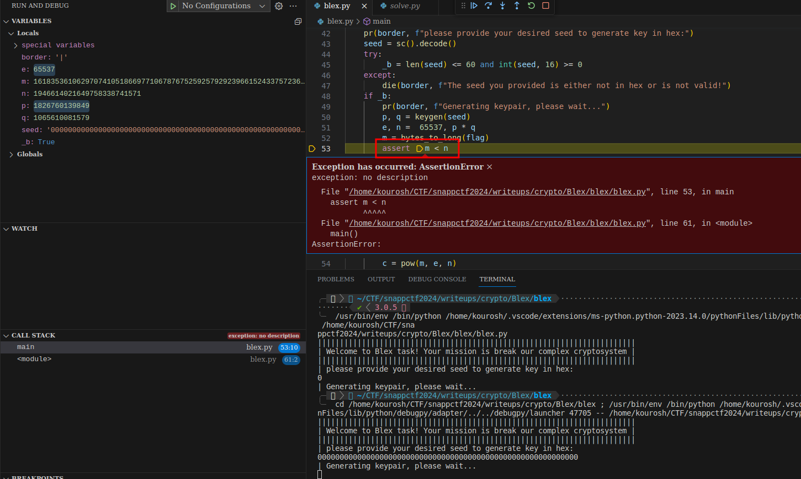
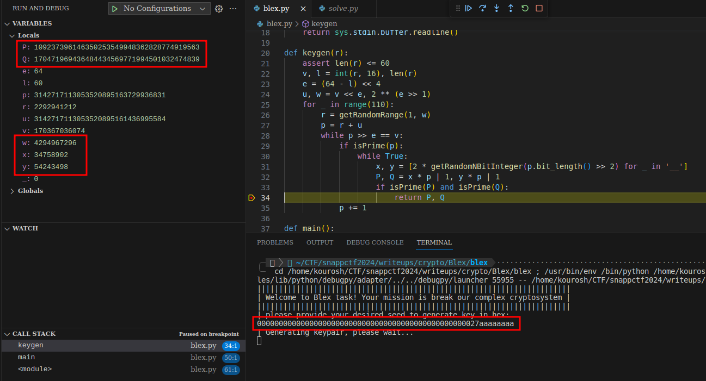

## Blex

[**Blex**](https://snappctf.com/tasks/blex_d5497876fd46f852c5854aae4f4448c7e9320839.txz) cryptosystem, despite its sluggish pace, boasts unparalleled security, resilient against all attacks. Now, examine its unyielding strength.

```python
#!/usr/bin/env python3
  
import sys
from Crypto.Util.number import *
from flag import flag

  
def die(*args):
  pr(*args)
  quit()
  
def pr(*args):
  s = " ".join(map(str, args))
  sys.stdout.write(s + "\n")
  sys.stdout.flush()
  
def sc(): 
  return sys.stdin.buffer.readline()

def keygen(r):
  assert len(r) <= 60
  v, l = int(r, 16), len(r)
  e = (64 - l) << 4
  u, w = v << e, 2 ** (e >> 1)
  for _ in range(110):
    r = getRandomRange(1, w)
    p = r + u
    while p >> e == v:
      if isPrime(p):
        while True:
          x, y = [2 * getRandomNBitInteger(p.bit_length() >> 2) for _ in '__']
          P, Q = x * p | 1, y * p | 1
          if isPrime(P) and isPrime(Q):
            return P, Q
      p += 1

def main():
  border = "|"
  pr(border*72)
  pr(border, f"Welcome to Blex task! Your mission is break our complex cryptosystem", border)
  pr(border*72)
  pr(border, f"please provide your desired seed to generate key in hex:")
  seed = sc().decode()
  try:
    _b = len(seed) <= 60 and int(seed, 16) >= 0
  except:
    die(border, f"The seed you provided is either not in hex or is not valid!")
  if _b:
    pr(border, f"Generating keypair, please wait...")
    p, q = keygen(seed)
    e, n =  65537, p * q
    m = bytes_to_long(flag)
    assert m < n
    c = pow(m, e, n)
    pr(border, f'n = {n}')
    pr(border, f'c = {c}')
  else:
    die(border, f"Your seed is too long!!!")

if __name__ == '__main__':
  main()
```

## Solution
the code simply does these steps
1. get an input from user as a seed
2. generates `P,Q` (RSA prime factors) based on that seed with an special algorithm
3. encrypts the flag with generated RSA key

The key generation part is interesting.
let's break it down to see what is happening under the hood

1. consider our seed as `s`
2. it casts it to decimal base as `v` and the hex value length as `l`
3. then it generates `e` as  $(64-l) * 16$ (e is dependent on `l`, the larger the `l` or seed length, the smaller value for `e` )
4. two values `u,w` are generated: $u = v * 2^{e}$ and $w = 2^{(e/2)}$ (`u` and `v` both are dependent on `e`, it means the larger seed length -> the smaller `e` -> the smaller `u` and `w`)
5. then it enters a for loop
	1. first it generates a random `r` in range `[1,w)` -> not including `w` itself 
	2. then the code calculates a `p` like: $p = r + u$
	3. then it enters a loop 
		1. first it generates a pair `(x,y)` in length of $bitlen(p)/4$ bit
		2. then it calculates `P` and `Q` like: $P = x * p | 1$ and $Q = y * p | 1$ -> `|` is OR bit-wise operator means if $xp$ or $yp$ are even (0 value for LSB bit) it will make it `1` . so it will be $xp + 1$ or $xp$. it all depends on if $xp$ is even or odd. we know that `P` and `Q` should be prime so they can not be in form of $P = xp$  and $Q = yp$ so they should be in form of $P = xp + 1$ and $Q = yp + 1$
		3. return `P` and `Q` when they both are prime and these are our RSA factors


if we look deep into the algorithm the value of `P` and `Q` are highly dependent on our seed value and length. Let's run the code with seed  `0`



as we can see the primes are large although the value `v` is small but the `e` is large because of small length of seed
let's examine this seed `'0'*59`



our `v` and `e` are the smallest possible and we can see the factors are very small that makes it easy to factorize `n` and break RSA but there is an issue here


because our `n` is very small (`n<m`) so we can not get the encrypted flag.
let's see how n is generated based on our seeds


<center>
$n = P \cdot Q$

$P = p \cdot x + 1$

$Q = p \cdot y + 1$

$n = (p \cdot x + 1) \cdot (p \cdot y + 1) \quad \longrightarrow \quad 2^{\left(\frac{\log_2{p}}{4}-1\right)} < x,y < 2^{\frac{\log_2{p}}{4}}$

$n = (p^2) \cdot (x \cdot y) + p \cdot x + p \cdot y + 1$
</center>

The solution I was thinking about was about first find `p` then find `x,y` and calculate `P,Q`. I was thinking about brute-forcing them but it only is possible when they are small.
let's see how we can feed our algorithm with a seed that `p,x,y` are small meanwhile `P` and `Q` are large enough such that `n > m`.

The thing I was sure about to consider `l` as maximum possible value (60) because it results in small `e` then small `w` we know  `w` is only dependent on `l` and `p` is dependent on `r` and `u` because we have the value `u` we only need `1 < r < w` to find `p`. so the larger `l` leads to smaller `e` and smaller `w` and smaller `r` and makes it easier to find `r`
if we consider `l` as 60 the `w` will value be like this

<center>
$l = 60$

$e = (64-l)*2^{4}$

$e = 4*2^{4}$

$e = 64$

$w = 2^{(e/2)}$

$w = 2^{32}$

$w = 4294967296$

$1 < r < 4294967296$
</center>

we have `u` we only need to predict r to find p

after some trial/error I found this value which generates reasonable value for p that $P*Q > m$ and also $x,y$ are not large

```
000000000000000000000000000000000000000000000000027aaaaaaaa
```



after trying several times with seed value of `000000000000000000000000000000000000000000000000027aaaaaaaa` and failing of `asser m < n` finally I could get a pair of `n,c` like this
```python
n = 37931218957771298432929684440033399181023597655092027699229762505394899064299
c = 37619517047698062658731745404907573919781841044311054904796485400329681024110
```

here we have these conditions

```python
1 < r < 4294967296

>>> p = 3142717113053520895163729936831
>>> p.bit_length() >> 2
25
>>> 2 ** 24
16777216
>>> 2 ** 25
33554432

2*16777216 < x , y < 2*33554432
```

OK now we can brute force the range `(1, 4294967296)` to find `r` but how to verify what the correct `r` is?
we know that:

```python
n = (p**2)*(x*y) + p*x + p*y + 1
# we can verify correct r like this

if (n-1) % (u+r) == 0
# p = u + r
```
$n = (p^2)(x \cdot y) + p \cdot x + p \cdot y + 1$

We can verify correct $r$ like this:

If $(n - 1) \mod (u + r) = 0$, then $p = u + r$.


after find the correct `r` we can brute force and find `x,y` like this
we know that $P = x*p + 1$ so `n` divides $x*p + 1$ so $n-1$ divides both  `x` and `p`

```python
bits = p.bit_length() >> 2 # bits = 25
for x in range(2 * 2**(bits-1), 2*2**bits):
	if (n % (x*p + 1)) == 0:
		print(x)
```


Let's code all these levels to see if we can recover `p,x,y` and factorize `n`

```python
from Crypto.Util.number import *

n = 37931218957771298432929684440033399181023597655092027699229762505394899064299
c = 37619517047698062658731745404907573919781841044311054904796485400329681024110
s = '000000000000000000000000000000000000000000000000027aaaaaaaa\n'

v, l = int(s, 16), len(s)
e = (64 - l) << 4
u, w = v << e, 2 ** (e >> 1)

r = 0
for rr in range(w, 0, -1):
    p = rr + u
    if (n-1) % p == 0:
        r = rr
        print(f"r = {r}")

xy = []
bits = p.bit_length() >> 2
for x in range(2 * 2**(bits-1), 2*2**bits):
    if (n % (x*p + 1)) == 0:
        print(x)
        xy.append(x)

p = r + u

P = xy[0]*p + 1
Q = xy[1]*p + 1
e = 0x10001
phi = (P-1)*(Q-1)
d = inverse(e, phi)
m = pow(c, d, n)
flag = long_to_bytes(m).decode()
print(flag)
```

the code will take some time to find the correct `r` but after that it will find `x,y` and decrypts the flag


```
SNAPP{b3Y0nd_4Ny_FoRM_1n_8lEx!?}
```

> Authors - [Kourosh Rajabzadeh](https://github.com/KooroshRZ)