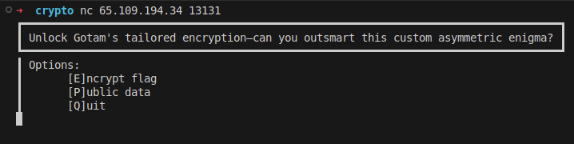
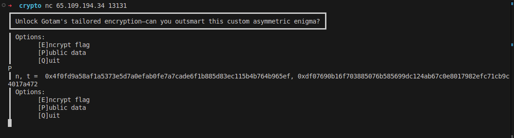
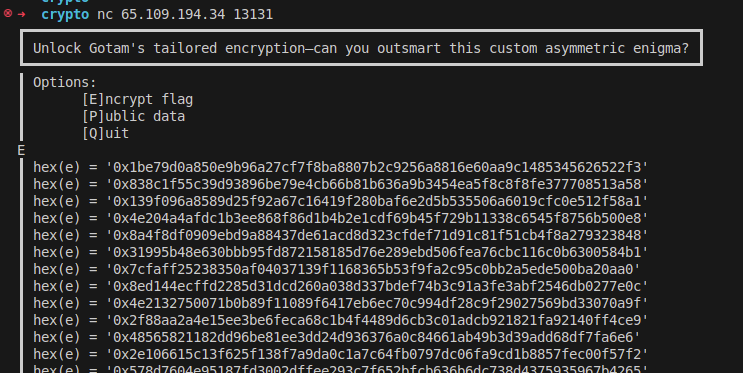
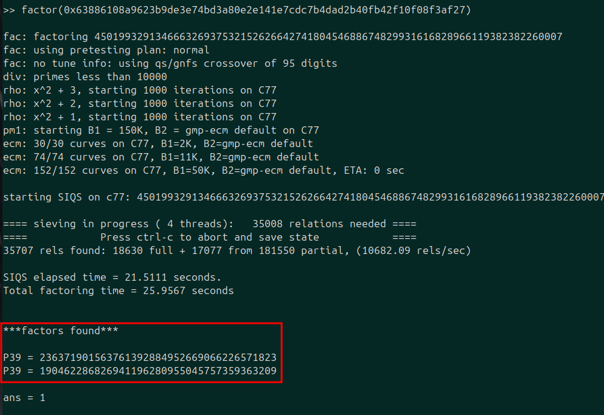
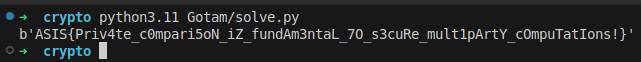

## Gotam

|Category|Difficulty|Score|Solves|First 🩸|
|:-|:-|:-|:-|:-|
|Crypto|Getting There 🤓|98|46|Pwnguins|

## Code / Description

```
Calling Gotam a "challenge" is like calling a nap "extreme sports" :D

nc 65.109.194.34 13131
```

```py
#!/usr/bin/env python3

import sys
from Crypto.Util.number import *
from flag import flag

def die(*args):
    pr(*args)
    quit()

def pr(*args):
    s = " ".join(map(str, args))
    sys.stdout.write(s + "\n")
    sys.stdout.flush()

def sc():
    return sys.stdin.buffer.readline()

def check_nr(a, p, q):
    return pow(a, (p - 1) // 2, p) == p - 1 and pow(a, (q - 1) // 2, q) == q - 1

def gotam(nbit):
    p, q = [getPrime(nbit) for _ in ':)']
    n = p * q
    while True:
        t = getRandomRange(1, n - 1)
        if check_nr(t, p, q):
            break
    return (n, t), (p, q)

def encrypt(msg, pubkey):
    n, t = pubkey
    M = bin(bytes_to_long(msg))[2:].zfill(1 << 10)
    l = len(M)
    E = [
        t ** int(M[_]) * getRandomNBitInteger(n.bit_length() - 1) ** 2 % n
        for _ in range(l)
    ]
    return E

def main():
    border = "┃"
    pr(
        "┏━━━━━━━━━━━━━━━━━━━━━━━━━━━━━━━━━━━━━━━━━━━━━━━━━━━━━━━━━━━━━━━━━━━━━━━━━━━━━━━━━━━━┓"
    )
    pr(
        border,
        "Unlock Gotam's tailored encryption—can you outsmart this custom asymmetric enigma?",
        border,
    )
    pr(
        "┗━━━━━━━━━━━━━━━━━━━━━━━━━━━━━━━━━━━━━━━━━━━━━━━━━━━━━━━━━━━━━━━━━━━━━━━━━━━━━━━━━━━━┛"
    )
    pubkey, privkey = gotam(128)
    del privkey
    while True:
        pr(
            f"{border} Options: \n{border}\t[E]ncrypt flag \n{border}\t[P]ublic data \n{border}\t[Q]uit"
        )
        ans = sc().decode().strip().lower()
        if ans == "e":
            enc = encrypt(flag, pubkey)
            for e in enc:
                pr(border, f"{hex(e) = }")
        elif ans == "p":
            pr(border, "n, t = ", ", ".join(map(hex, pubkey)))
        elif ans == "q":
            die(border, "Quitting...")
        else:
            die(border, "Bye...")

if __name__ == "__main__":
    main()
```


## Overview

This challenge is about exploiting a side-channel attack on an oracle that behaves differently based on the Legendre symbol of the flag bits. Before this, we need to factor a composite number to calculate the Legendre symbol easily. The overall process would be:

+ get public info (n, t)  and factor n to calculate the Legendre symbol
+ gather data based on the flag bits
+ extract the value (0,1) based on the Legendre symbol related to the flag bits

## Challenge Analysis

This challenge has a remote instance that has two basic functionalities. Let's see the corresponding code

```py
while True:
    pr(
        f"{border} Options: \n{border}\t[E]ncrypt flag \n{border}\t[P]ublic data \n{border}\t[Q]uit"
    )
    ans = sc().decode().strip().lower()
    if ans == "e":
        enc = encrypt(flag, pubkey)
        for e in enc:
            pr(border, f"{hex(e) = }")
    elif ans == "p":
        pr(border, "n, t = ", ", ".join(map(hex, pubkey)))
    elif ans == "q":
        die(border, "Quitting...")
    else:
        die(border, "Bye...")
```



This is the menu we have, option `p` will give the public data (n,t), and option e will give us the encrypted flag. Let's see how the public data and encryption work.

This is the key generation part.

```py
def check_nr(a, p, q):
    return pow(a, (p - 1) // 2, p) == p - 1 and pow(a, (q - 1) // 2, q) == q - 1

def gotam(nbit):
    p, q = [getPrime(nbit) for _ in ':)']
    n = p * q
    while True:
        t = getRandomRange(1, n - 1)
        if check_nr(t, p, q):
            break
    return (n, t), (p, q)

pubkey, privkey = gotam(128)
del privkey
```




The `gotam` function will generate two 128 prime numbers and calculate a parameter $ n=p*q $. It will also generate a variable $ t $ that is a Quadratic Non-Residue modulus $ n $. The `check_nr` is intended to check this. If you want to know more about the Legendre symbol or what is quadratic residue, I highly recommend checking [this link](https://cryptohack.org/challenges/maths/) from cryptohack, especially the challenges Quadratic Residues, Legendre Symbol, and Modular Square Root.

To be brief, the Legendre symbol is calculated to check if a number is a quadratic residue modulus a prime number p. We call a number a quadratic residue if it has a square root modulus a prime number. If the modulus number is a composite number like $ n=p*q $ then to calculate the Legendre symbol, we need to have the factors of $ n $ and calculate the Legendre Symbol for each factor separately. If any of them is -1 modulus the factor, then the number is a quadratic non-residue modulus n.

And this is the flag encryption part.


```py
def encrypt(msg, pubkey):
    n, t = pubkey
    M = bin(bytes_to_long(msg))[2:].zfill(1 << 10)
    l = len(M)
    E = [
        t ** int(M[_]) * getRandomNBitInteger(n.bit_length() - 1) ** 2 % n
        for _ in range(l)
    ]
    return E
```



The encryption part is quite interesting; it will convert the flag to binary format and will adjust it to match a 1024-bit message with 0 values for MSB bits. Then, it will calculate a value based on the 0,1 value of the flag bits.

<center>

$t^{bit\_value} * {random\_number}^2$

</center>

Then it will print this output to the user, and this process will be done for every single bit of the flag.


## Solution

It seems we need to tackle a quadratic residue problem in this challenge. By the rule, we know that

+ $\text{residue} × \text{residue} = \text{residue}$
+ $\text{residue} \times \text{non-residue} = \text{non-residue}$
+ $\text{non-residue} × \text{non-residue} = \text{residue}$

We know that the variable $ t $ is a quadratic non-residue. We also have a definite quadratic residue value in our encryption:

```py
getRandomNBitInteger(n.bit_length() - 1) ** 2
```

Let's see what will happen based on the flag bit value (R is a random value):


$bit=1 \rightarrow e = t^1 * R^2 = t * R^2 \quad (\text{quadratic non-residue})$

$bit=0 \rightarrow e = t^0 * R^2 = R^2 \quad (\text{quadratic residue})$

Based on the rule mentioned, because $ R^2 $ is a quadratic residue, if it is multiplied by $ t $ (when the flag bit is 1), then the result (e) will be a quadratic non-residue. But if it is not multiplied by $ t $ (when the flag bit is 0), then the result will be a quadratic residue.

So all we need to do is to check if the sequence of $ e $ values for every flag bit is a quadratic residue or non-residue. To do this, we need to calculate the Legendre symbol of every $ e $ ciphertext. Because we are working modulus $ n $, which is a composite number $ n=p*q $, we can not simply calculate like the prime modulus. To that, we need to factor the $ n $ and calculate the Legendre Symbol modulus for each factor `p,q` separately. I used yafu to factor `n`, and it is feasible because `n` is 256 bits.



Now that we have the factors (p,q), we can easily check each ciphertext to determine the flag bit based on the quadratic residue or non-residue of the ciphertext.

This would be the function to check if the ciphertext is a quadratic residue or a non-residue

```py
def check_rs(a):
    return ((pow(a, (p-1)//2, p) == 1) and (pow(a, (q-1)//2, q) == 1))*1
```

And to determine the flag bits, if the $ e $ value is a quadratic residue (the function output is 1), it means the flag bit is 0, so the `1 - check_rs()` would be 0. On the other hand, if the $ e $ is a quadratic non-residue (the function output is 0), it means the flag bit is 1, so the `1 - check_rs()` would be 1.

```py
for line in lines:
    e = re.findall(r'hex\(e\) = \'([0-9a-f,x]+)\'', line)[0]
    t = 1 - check_rs(int(e, 16))
    m += str(t)
```

I wrote this code to read the ciphertexts (e value) from a file, check if they are quadratic residue or non-residue, and build the flag bits.

```py
import re

n = 0x63886108a9623b9de3e74bd3a80e2e141e7cdc7b4dad2b40fb42f10f08f3af27
t = 0x2b4e57db87cdda65e8a1ba77345abd6977c3e8ca84dfb285270ce622eb7ccf1b

p = 236371901563761392884952669066226571823
q = 190462286826941196280955045757359363209


def check_rs(a):
    return ((pow(a, (p-1)//2, p) == 1) and (pow(a, (q-1)//2, q) == 1))*1

f = open('./Gotam/output.txt')
lines = f.readlines()

m = ''

for line in lines:
    e = re.findall(r'hex\(e\) = \'([0-9a-f,x]+)\'', line)[0]
    t = 1 - check_rs(int(e, 16))
    # print(t)
    m += str(t)

m = int(m, 2)
flag = m.to_bytes(m.bit_length(), 'big')
print(flag.strip(b'\x00'))
```

And here is the output of the code:




## Final Code

```py
import re

n = 0x63886108a9623b9de3e74bd3a80e2e141e7cdc7b4dad2b40fb42f10f08f3af27
t = 0x2b4e57db87cdda65e8a1ba77345abd6977c3e8ca84dfb285270ce622eb7ccf1b

p = 236371901563761392884952669066226571823
q = 190462286826941196280955045757359363209


def check_rs(a):
    return ((pow(a, (p-1)//2, p) == 1) and (pow(a, (q-1)//2, q) == 1))*1

f = open('./Gotam/output.txt')
lines = f.readlines()

m = ''

for line in lines:
    e = re.findall(r'hex\(e\) = \'([0-9a-f,x]+)\'', line)[0]
    t = 1 - check_rs(int(e, 16))
    m += str(t)

m = int(m, 2)
flag = m.to_bytes(m.bit_length(), 'big')
print(flag.strip(b'\x00'))
```


## Flag

```
ASIS{Priv4te_c0mpari5oN_iZ_fundAm3ntaL_7O_s3cuRe_mult1pArtY_cOmpuTatIons!}
```

## Authors

> [Kourosh Rajabzadeh](https://github.com/KooroshRZ)