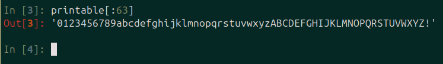
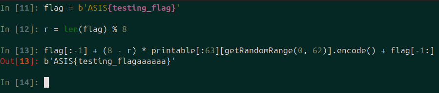
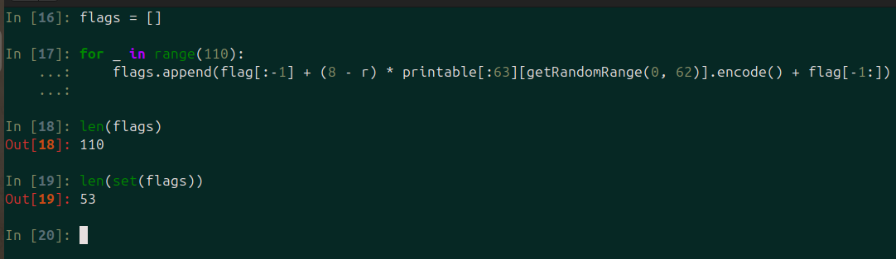
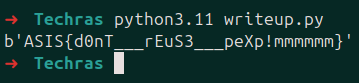

## Techras

|Category|Difficulty|Score|Solves|First 🩸|
|:-|:-|:-|:-|:-|
|Crypto|Baby 👶|29|301|G3|

## Code / Description

```
I'm having trouble determining when to discard a number versus when to reuse it in Techras. Any advice would be helpful!
```

```py
#!/usr/bin/env python3

from Crypto.Util.number import *
from string import *
from flag import flag

def pad(flag):
	r = len(flag) % 8
	if r != 0:
		flag = flag[:-1] + (8 - r) * printable[:63][getRandomRange(0, 62)].encode() + flag[-1:]
	return flag

def genkey(nbit):
	p, q = [getPrime(nbit) for _ in ':)']
	n = p * q
	return n, (p, q)

def encrypt(msg, pubkey):
	msg = pad(msg)
	e = getPrime(32)
	m = bytes_to_long(msg)
	c = pow(m, e, pubkey)
	return str(c) + str(e)

nbit = 1024
pubkey, _ = genkey(nbit)

print(f'n = {pubkey}')
for _ in range(110):
	print(f'c = {encrypt(flag, pubkey)}')
```


## Overview

This challenge consists of these overall steps.

Generate a weak random padding for the flag ‍`ASIS{flag_text<padding>}`
Encrypt the padded flag with different public exponent (E) but same modulus (N) 110 times.
Perform a Common modulus attack to obtain the flag (due to the pigeonhole principle, there are at least two flags with the same padding)


## Challenge Analysis


If we look at the source code, everything seems like a trivial RSA implementation. But the padding schema, the public exponent(E), and the number of encryption attempts look a bit weird.


First of all, the key generation part looks normal (2048-bit key RSA)

```py
def genkey(nbit): # nbit = 1024
	p, q = [getPrime(nbit) for _ in ':)']
	n = p * q
	return n, (p, q)
```

Now let's take a look at the encryption process. For each encryption, the algorithm generates a new E and encrypts the message with a different E, which is a 32-bit prime number, which is not the trivial method of using one constant E (65537) for the encryption.

```py
def encrypt(msg, pubkey):
	msg = pad(msg)
	e = getPrime(32)
	m = bytes_to_long(msg)
	c = pow(m, e, pubkey)
	return str(c) + str(e)
```

Now let's take a look at the padding schema. If the message length is not divisible by 8, it is going to perform padding like this on the message


```py
def pad(flag):
	r = len(flag) % 8
	if r != 0:
		flag = flag[:-1] + (8 - r) * printable[:63][getRandomRange(0, 62)].encode() + flag[-1:]
	return flag
```

```
'ASIS{flag' + random_character*(8- msg_length) + '}'
```

The padding is a random character chosen among these characters, and it is repeated (8 - msg_length) times

```
0123456789abcdefghijklmnopqrstuvwxyzABCDEFGHIJKLMNOPQRSTUVWXYZ!
```



So an example padding on a test flag would be like this:



Now it's time for the last part of the code, as we see the code is encrypting the flag with different paddings and different public exponent (E) and prints it as [output](../extra/techras_output.txt) for sample ciphertexts.

```py
for _ in range(110):
	print(f'c = {encrypt(flag, pubkey)}')
```

## Solution

We need to search for a vulnerability among code parts which is not a trivial safe method. According to the source code, the padding schema and public exponent generation part are not normal, and they might expose some weaknesses that we can exploit to decrypt the sample ciphertext, which has a flag with its padding.

The padding section is using a space of only 63 characters with repetition. On the other hand, we have 110 ciphertexts, each of which uses a random character for padding. According to the pigeonhole principle, there should be at least two flags which has the same padding.



Now we can assure that there are ciphertexts that contain the same message (flag + same padding) and the same modulus but with different E.

With some research, we can find [This Stack Overflow Link](https://crypto.stackexchange.com/questions/16283/how-to-use-common-modulus-attack), which explains some sort of attack on RSA that holds the same condition. By encrypting one message with two different E and shared N, we can decrypt the message without knowing the private key. But there should be one condition to make this attack successful.

<div class="arithmatex" align="center">

$gcd(e1, e2) = 1$

</div>

We already know that e1 and e2 are coprime because all e values are prime numbers. For the second condition, there is almost 0% chance that the second ciphertext had a common factor(p or q) with n. But we will check that.

The attack utilizes the extended Euclidean algorithm to find two integers ‍`a, b` such that:

<div class="arithmatex" align="center">

$a*e_1 + b*e_2 = gcd(e1, e2)$

</div>

We know that $gcd(e1, e2) = 1$ so:

<div class="arithmatex" align="center">

$a*e_1 + b*e_2 = 1$

</div>

If we calculate $c_1 ^ a * c_2 ^ b$ this would happen:

<div class="arithmatex" align="center">

$c_1 ^ a * c_2 ^ b = (m ^ {e_1}) ^ a * (m ^ {e_2}) ^ b$

$= m ^ {a * {e_1}} * m ^ {b * e_2} = m ^ {a * e_1 + b * e_2}$

$\xrightarrow{gcd(e1, e2) = 1} = m^1 = m$

</div>

NOTE: It is trivial that one of `a` or `b` should hold a negative value. So gcd(c1, n) and gcd(c2, n) should be `1` for c1 and c2 to be invertible. There is almost a 0% chance that c1 or c2 holds a common factor(p or q) with n.

We see that by computing $c_1 ^ a * c_2 ^ b$ , we will actually get m, which is the flag.
Now the only thing we need to have is two ciphertexts which is for the same message but with different coprime public exponents. We already know that all public exponents are prime, so they will be coprime to each other. We also know that there are at least two flags with the same padding that satisfy the second condition, but we don't know which two ciphertexts hold the same message. To overcome this issue, we can perform the mentioned attack on all possible ciphertext pairs and check if the computed value decodes to a readable flag; those two would be the answer.

Now let's code the overall process. First of all, we need to parse the output file to extract ciphertexts and public exponents.

```py
def read_file(filename):

    n = 0
    e_values = []
    c_values = []
    c_e_values = []

    with open(filename, 'r') as f:

        data = f.read()
        n = int(re.findall(r'n = (\d+)', data)[0])
        c_e_values = re.findall(r'c = (\d+)', data)

        for c_e in c_e_values:
            potential_e = int(c_e[-10:]) # 32 bit numbers has 10 digits
            if isPrime(potential_e):
                e_values.append(potential_e)
                c_values.append(int(c_e[:-10]))

        f.close()
    
    return n, c_values, e_values
```

Then we need to implement the egcd algorithm. If you want to learn more details about this algorithm and how to implement it, I highly recommend solving `Extended GCD` challenge from [CryptoHack](https://cryptohack.org/challenges/general/) `General Section`.

```py
def extended_euclidean(x, y):

    if y == 0:
        return (x, 1, 0)
    else:
        g, x1, y1 = extended_euclidean(y, x % y)
        a = y1
        b = x1 - (x // y) * y1
        return g, a, b
```

Next, we should implement the attack

```py
def common_modulus_attack(n, e1, e2, c1, c2):

    g, a, b = extended_euclidean(e1, e2)
    if g == 1 and gcd(c1, n) == 1 and gcd(c2, n) == 1: # check two e values / c1,c2 and n are coprime

        m = pow(c1, a, n) * pow(c2, b, n) % n
        flag = long_to_bytes(m)
        return flag
```

And finally, we need to check all possible pairs of ciphertexts

```py
for i in range(len(pairs)):
    for j in range(i+1, len(pairs)):
        flag = common_modulus_attack(n, pairs[i][0], pairs[j][0], pairs[i][1], pairs[j][1])
        if b'ASIS' in flag:
            print(flag)
            exit(1)
```

And here is the output of the solution code:



Yes, we got the flag. All we need to do is to remove the padding part `mmmmmm`
And here is the original flag

```
ASIS{d0nT___rEuS3___peXp!}
```

## Final Code

```py
import re
from Crypto.Util.number import isPrime, long_to_bytes
from math import gcd

def extended_euclidean(x, y):

    if y == 0:
        return (x, 1, 0)
    else:
        g, x1, y1 = extended_euclidean(y, x % y)
        a = y1
        b = x1 - (x // y) * y1
        return g, a, b


def common_modulus_attack(n, e1, e2, c1, c2):

    g, a, b = extended_euclidean(e1, e2)
    if g == 1 and gcd(c2, n) == 1: # check two e values / c2 and n are coprime

        m = pow(c1, a, n) * pow(c2, b, n) % n
        flag = long_to_bytes(m)
        return flag
    

def read_file(filename):

    n = 0
    e_values = []
    c_values = []
    c_e_values = []

    with open(filename, 'r') as f:

        data = f.read()
        n = int(re.findall(r'n = (\d+)', data)[0])
        c_e_values = re.findall(r'c = (\d+)', data)

        for c_e in c_e_values:
            potential_e = int(c_e[-10:]) # 32 bit numbers has 10 digits
            if isPrime(potential_e):
                e_values.append(potential_e)
                c_values.append(int(c_e[:-10]))

        f.close()
    
    return n, c_values, e_values


n, cs, es = read_file('techras_output.txt')
pairs = []
for e, c in zip(es, cs):
    pairs.append((e, c))

for i in range(len(pairs)):
    for j in range(i+1, len(pairs)):
        flag = common_modulus_attack(n, pairs[i][0], pairs[j][0], pairs[i][1], pairs[j][1])
        if b'ASIS' in flag:
            print(flag)
            exit(1)
```


## Flag

```
ASIS{d0nT___rEuS3___peXp!}
```

## Authors

> [Kourosh Rajabzadeh](https://github.com/KooroshRZ)