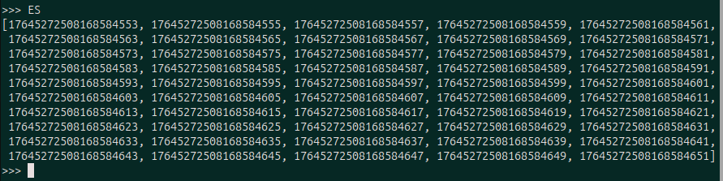
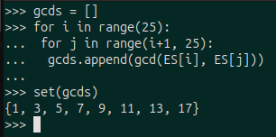
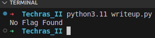
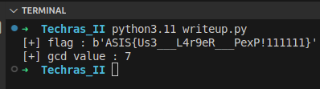

## Techras II

|Category|Difficulty|Score|Solves|First 🩸|
|:-|:-|:-|:-|:-|
|Crypto|Getting There 🤓|71|69|TheBacterias|

## Code / Description


```
Thanks to the guidance on the Techras challenge, I've learned a lot. I think I finally understand when to discard a number versus when to reuse it. To be honest, I feel like I've got it all figured out now with Techras II. Don't you agree?
```

```py
#!/usr/bin/env python3

from Crypto.Util.number import *
from string import *
from flag import flag

def pad(flag):
	r = len(flag) % 8
	if r != 0:
		flag = flag[:-1] + (8 - r) * printable[:72][getRandomRange(0, 71)].encode() + flag[-1:]
	return flag

def genkey(nbit):
	e = getPrime(64)
	p, q = [getPrime(nbit) for _ in ':)']
	n = p * q
	return (e, n), (p, q)

def encrypt(msg, pubkey):
	e, n = pubkey
	msg = pad(msg)
	m = bytes_to_long(msg)
	c = pow(m, e, n)
	return c

nbit = 1024
pubkey, _ = genkey(nbit)

e, n = pubkey
print(f'n = {n}')
for _ in range(25):
	print(f'c = {encrypt(flag, (e, n))}')
	e += 2
print(f'e = {e}')
```


## Overview

This challenge is the second version of Techras challenge with some changes.

+ increase the padding schema space from 63 possible characters to 72 characters
+ Decrease the number of encryption attempts from 110 to 25
+ change the public exponent behaviour

To solve this challenge, we need to

+ Compute the probability of the occurrence of the same padding for the flag
+ perform common modulus attack with a hope of a low gcd value for possible pairs of public exponents


## Challenge Analysis


This challenge is actually the second version of Techras challenge with some differences. It is observable that the conditions have been more difficult, and we can not simply perform the common modulus attack due to several reasons.

+ The number of encryptions decreased to 25, and the possible characters of padding increased to 72 characters. This means we can not assure that two identical messages have the same padding
+ The public exponent generation is changed. The first one is a 64-bit prime, and for each encryption, it is increased by 2.

According to the new changes, we will no longer be able to solve the challenge like the previous version, but there are still some weaknesses.

## Solution

Let's assume the occurrence of the same padding in two ciphertexts among 25 ciphertexts is $A$. We can do it by the Complement Rule in probability. Let's see what the probability is of not occurring redundant padding in these 25 ciphertexts.

<center>

$P(A') = \underbrace{ \frac{72}{72} * \frac{71}{72} * \frac{70}{72} * \cdots * \frac{48}{72}}_{25 \text{ times}} = 0.008$

</center>

As we see, the probability of not having the same padding for two ciphertexts among 25 ciphertexts is 0.008. So the probability of seeing the same padding for two ciphertexts among 25 total would be:

<center>

$P(A) = 1 - P(A') = 1 - 0.008 = 0.998 \approx 1$

</center>

Although our ciphertexts(25) are much less than the whole possible paddings(72), we can almost % 100% be sure that the flag has been padded with the same padding. This is what is called [birthday paradox](https://betterexplained.com/articles/understanding-the-birthday-paradox/) in cryptography.

Now let's check the public exponent part.

```py
def genkey(nbit):
	e = getPrime(64)
	p, q = [getPrime(nbit) for _ in ':)']
	n = p * q
	return (e, n), (p, q)

nbit = 1024
pubkey, _ = genkey(nbit)

e, n = pubkey
print(f'n = {n}')
for _ in range(25):
	print(f'c = {encrypt(flag, (e, n))}')
	e += 2
print(f'e = {e}')
```


For the first encryption, a 64-bit prime number was generated, and each time it was increased by two for the next encryption. So the public exponents would be like:

<center>

$\underbrace{E , E+2 , E+4 , \cdots , E+48}_{25 \text{ total}}$

</center>

We have 25 different public exponents, so we will have 300 possible pairs in total:

<center>

${25 \choose 2} = \frac{25*24}{2} = 300$

</center>

We already know that although our number of ciphertexts(25) is much less than the whole possible padding space(72), we still can be sure with a chance of %0.99 that we have the same padding in our ciphertext due to the birthday paradox. So let's see if our public exponents are coprime to each other or not.

These are all the E values we have (25 in total):



If we calculate all possible gcd of two pairs, we will get 8 possible values `{1, 3, 5, 7, 9, 11, 13, 17}`. It is obvious that although we have an encrypted flag with the same padding, their corresponding public exponents may not be coprime (gcd > 1). 




So performing the common modulus attack may lead to calculating different values. Let's see what we may get by performing the same attack. By the Extended gcd, we have:


<center>

$\forall\ x,y \quad \exists\ a,b \quad \rightarrow \quad ax + by = gcd(x,y)$

</center>

Let's assume we have found corresponding `a,b` for an example pair `e1,e2`, Let's see what will happen if we perform the attack.

<center>

${c_1} ^ a * {c_2} ^ b = (m^{e_1}) ^ a * (m^{e_2}) ^ b = m^{ae_1} * m^{be_2} = m^{ae_1 + be_2} = m^{gcd(e1,e2)}$

</center>

If $gcd(e1, e2)$ is greater than 1, then we will not get directly the $\:m\:$ but $\:m\:$ to a power of a value greater than 1. According to the possible gcd values for all e values, we have

<center>

$1, 3, 5, 7, 9, 11, 13, 17$

</center>

Let's perform the attack to see if we can find a flag padded with the same characters and encrypted twice with two coprime public exponents.

First, we need to read the file and build a dict of `E:C` values.

```py
def read_file():

    msgs = {}

    f = open('./TechrasII/Techras_II/output.txt')
    lines = f.read()

    N = int(re.findall(r'n = (\d+)', lines)[0])
    CC = re.findall(r'c = (\d+)', lines)
    E = int(re.findall(r'e = (\d+)', lines)[0])

    index = 50
    for C in CC:
        msgs[E - index] = int(C)
        index -= 2

    return msgs, N
```

Then we need to perform the common modulus attack, but we don't know whether the gcd of two e values is 1 or not. Let's see and implement this function:

```py
def recover_m(c1, c2, e1, e2, n):

    g, x, y = extended_euclidean(e1, e2)
    if g == 1:
        m = pow(c1, x, n)*pow(c2, y, n) % n

    flag = long_to_bytes(m)
    if b'ASIS' in flag:
        print(flag)
		exit(1)
```

And try all possible ciphertext pairs with their corresponding e values:

```py
msgs, N = read_file()

items = list(msgs.items())  # (e, c)
for (e1, c1), (e2, c2) in combinations(items, 2):
    recover_m(c1, c2, e1, e2, N)
print("No Flag Found")
```

Let's see what will happen.



As we can see, there is no flag with the same padding and two co-prime e values. So let's assume the gcd of two public exponents for the same padded flags is one of the values `{1, 3, 5, 7, 9, 11, 13, 17}`. So by performing the attack, we will get one of these values. 


<center>

$m, m^3, m^5, m^7, m^9, m^{11}, m^{13}, m^{17}$.

</center>

We can hope that our $\:M\:$ is not that large, so the values $\:\:m^k \quad k \in \{1, 3, 5, 7, 9, 11, 13, 17\} \:\:$ are less than $N$. In this case, we can calculate $M$ by computing the k-th root of the result.

Let's implement the function og calculating the k-th root of a number. You can also use libraries like gmpy.

```py
def nth_root(x, n):

    upper_bound = 1
    while upper_bound ** n <= x:
        upper_bound *= 2
    lower_bound = upper_bound // 2
    while lower_bound < upper_bound:
        mid = (lower_bound + upper_bound) // 2
        mid_nth = mid ** n
        if lower_bound < mid and mid_nth < x:
            lower_bound = mid
        elif upper_bound > mid and mid_nth > x:
            upper_bound = mid
        else:
            return mid
    return mid + 1
```

Now we need to change our function to try all possible gcd values (not only those with value 1, which are coprime)

```py
def recover_m(c1, c2, e1, e2, n):

    g, x, y = extended_euclidean(e1, e2)
    m = pow(c1, x, n)*pow(c2, y, n) % n
    m = nth_root(m, g)
    
    flag = long_to_bytes(m)
    if b'ASIS' in flag:
        print(f'[+] flag : {flag}')
        print(f'[+] gcd value : {g}')
```

If we run this code, we will get the flag



We only need to remove the padding and get the original flag with a gcd value of `7` for two ciphertexts that had the same message, but with a gcd value of 7 for the related public exponents.

## Final Code

```py
from Crypto.Util.number import *
import re
from itertools import combinations

def read_file():

    msgs = {}

    f = open('techras_II_output.txt')
    lines = f.read()

    N = int(re.findall(r'n = (\d+)', lines)[0])
    CC = re.findall(r'c = (\d+)', lines)
    E = int(re.findall(r'e = (\d+)', lines)[0])

    index = 50
    for C in CC:
        msgs[E - index] = int(C)
        index -= 2

    return msgs, N

def nth_root(x, n):
    upper_bound = 1
    while upper_bound ** n <= x:
        upper_bound *= 2
    lower_bound = upper_bound // 2
    while lower_bound < upper_bound:
        mid = (lower_bound + upper_bound) // 2
        mid_nth = mid ** n
        if lower_bound < mid and mid_nth < x:
            lower_bound = mid
        elif upper_bound > mid and mid_nth > x:
            upper_bound = mid
        else:
            return mid
    return mid + 1

def extended_euclidean(a, b):
    
    if b == 0:
        return (a, 1, 0)
    else:
        g, x1, y1 = extended_euclidean(b, a % b)
        x = y1
        y = x1 - (a // b) * y1
        return (g, x, y)


def recover_m(c1, c2, e1, e2, n):

    g, x, y = extended_euclidean(e1, e2)
    m = pow(c1, x, n)*pow(c2, y, n) % n
    m = nth_root(m, g)
    
    flag = long_to_bytes(m)
    if b'ASIS' in flag:
        print(f'[+] flag : {flag}')
        print(f'[+] gcd value : {g}')


msgs, N = read_file()

items = list(msgs.items())  # (e, c)
for (e1, c1), (e2, c2) in combinations(items, 2):
    recover_m(c1, c2, e1, e2, N)
```


## Flag

```
ASIS{Us3___L4r9eR___PexP!}
```

## Authors

> [Kourosh Rajabzadeh](https://github.com/KooroshRZ)