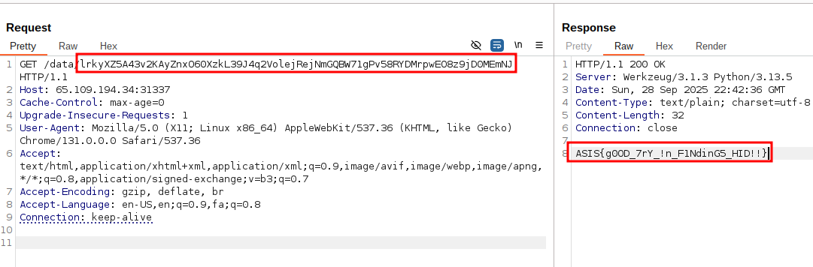

## Twin Oracle

|Category|Difficulty|Score|Solves|First 🩸|
|:-|:-|:-|:-|:-|
|Crypto|Baby 👶|334|7|Brunnerne|

## Code / Description

```
Functions are used on this page: http://65.109.194.34:31337

Idolatress I that seem understandable. Do your best to find the flag?
```

```py
#!/usr/bin/env python3

from flask import Flask, Response, abort
from secret import my_encoder, my_decoder, flag

app = Flask(__name__)

@app.route("/")
def index():
	with open(__file__, "r", encoding = "utf-8") as f:
		source = f.read()
	for i in range(2, 10):
		source += f"\n{i}: {my_encoder(i)}"
	return Response(source, mimetype = "text/plain")

@app.route("/data/<path:value>")
def data(value: str):
	if len(value) != 72:
		return abort(400, "Parameter must be exactly 72 characters long :|")
	try:
		decoded = my_decoder(value)
		if decoded == 1:
			return Response(flag, mimetype = "text/plain")
		else:
			return Response(f"{decoded} {value}", mimetype = "text/plain")
	except:
		return abort(400, "Bad Value!")

if __name__ == "__main__":
	app.run(host="0.0.0.0", port = 5000, debug = True)

2: g12pXA6R5M8EywXlDBVEA762Pr1gO3GWpmbk5ezJn4KRjLMvYok5xQZNq809WKkGqyDJ43LO
3: g8xlnDX7wkZ58D0r6qw143jxEYgLPQZOpnel5aKBzyVXvAWJ29Nl7MGmkRo5LJ0AGqNWV2yB
4: zop1YkV68O4qG8N9LzxkPZWjR7BErm0wMvbmOeYAlO1nqVyD42op63KgJQ5XmXyl5ZQRgrKN
5: kmEWDyx1jV6lZjlOWLnG5q2wNDm8VvJ4openRe7Az1XPYRrKM3xBy9Qk6Eg05OJZvBNKGqRL
6: X2GA7jZYlRMvV84j5K6m2oG9v1ZzQABWJxbojagwOL0EMrNYp3nR7DlykPqXyV43g9E0DwmK
7: gWqBE0Rk61XoBAloX50DL6rwOg3KWYxk8mep2bMyJNjQ9vGE7PqVnR2p4Z1zYjlJ7AVnvM8D
8: 7ZKjXy4r3nEmkDJ1jB590wGoANR8M7Vl4zbq2dprOZqEgL3m2XyYKvQnP6WxJ26pM1A0RDO8
9: XDOBmyopJ1Qj182mDwPjZEkqNz7x3VXyMYerEdOBQn6LlRGJ54rKgoWv0pA907vV8wMYz3GA
```


## Overview


## Challenge Analysis


## Solution





## Final Code


## Flag

```
ASIS{g0OD_7rY_!n_F1NdinG5_HID!!}
```

## Authors

> [Kourosh Rajabzadeh](https://github.com/KooroshRZ)