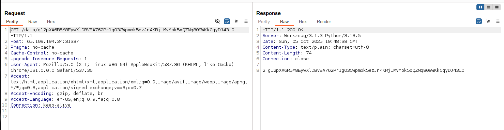
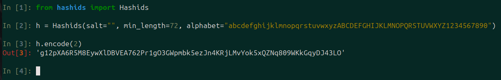
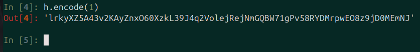
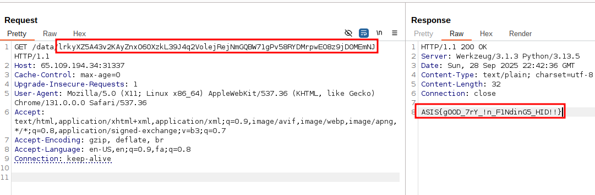

## Idolatress I

|Category|Difficulty|Score|Solves|First 🩸|
|:-|:-|:-|:-|:-|
|Web|Getting There 🤓|334|7|Brunnerne|

## Code / Description

```
Functions are used on this page: http://65.109.194.34:31337

Idolatress I that seem understandable. Do your best to find the flag?
```

```py
#!/usr/bin/env python3

from flask import Flask, Response, abort
from secret import my_encoder, my_decoder, flag

app = Flask(__name__)

@app.route("/")
def index():
	with open(__file__, "r", encoding = "utf-8") as f:
		source = f.read()
	for i in range(2, 10):
		source += f"\n{i}: {my_encoder(i)}"
	return Response(source, mimetype = "text/plain")

@app.route("/data/<path:value>")
def data(value: str):
	if len(value) != 72:
		return abort(400, "Parameter must be exactly 72 characters long :|")
	try:
		decoded = my_decoder(value)
		if decoded == 1:
			return Response(flag, mimetype = "text/plain")
		else:
			return Response(f"{decoded} {value}", mimetype = "text/plain")
	except:
		return abort(400, "Bad Value!")

if __name__ == "__main__":
	app.run(host="0.0.0.0", port = 5000, debug = True)

2: g12pXA6R5M8EywXlDBVEA762Pr1gO3GWpmbk5ezJn4KRjLMvYok5xQZNq809WKkGqyDJ43LO
3: g8xlnDX7wkZ58D0r6qw143jxEYgLPQZOpnel5aKBzyVXvAWJ29Nl7MGmkRo5LJ0AGqNWV2yB
4: zop1YkV68O4qG8N9LzxkPZWjR7BErm0wMvbmOeYAlO1nqVyD42op63KgJQ5XmXyl5ZQRgrKN
5: kmEWDyx1jV6lZjlOWLnG5q2wNDm8VvJ4openRe7Az1XPYRrKM3xBy9Qk6Eg05OJZvBNKGqRL
6: X2GA7jZYlRMvV84j5K6m2oG9v1ZzQABWJxbojagwOL0EMrNYp3nR7DlykPqXyV43g9E0DwmK
7: gWqBE0Rk61XoBAloX50DL6rwOg3KWYxk8mep2bMyJNjQ9vGE7PqVnR2p4Z1zYjlJ7AVnvM8D
8: 7ZKjXy4r3nEmkDJ1jB590wGoANR8M7Vl4zbq2dprOZqEgL3m2XyYKvQnP6WxJ26pM1A0RDO8
9: XDOBmyopJ1Qj182mDwPjZEkqNz7x3VXyMYerEdOBQn6LlRGJ54rKgoWv0pA907vV8wMYz3GA
```


## Overview

This challenge is about determining an encoding schema (hashids) and calculating a hashids for a specific input number.

## Challenge Analysis

Let's look at the source code.

These are normal flask and CTF stuff about importing libraries and the flag

```py
#!/usr/bin/env python3

from flask import Flask, Response, abort
from secret import my_encoder, my_decoder, flag

app = Flask(__name__)
```

This is the route through which we can observe the source code of the challenge.

```py
@app.route("/")
def index():
	with open(__file__, "r", encoding = "utf-8") as f:
		source = f.read()
	for i in range(2, 10):
		source += f"\n{i}: {my_encoder(i)}"
	return Response(source, mimetype = "text/plain")
```

And this is the challenge part, it gets an input from users, and after decoding it, if the decoded value is 1, it will give us the flag. 

```py
@app.route("/data/<path:value>")
def data(value: str):
	if len(value) != 72:
		return abort(400, "Parameter must be exactly 72 characters long :|")
	try:
		decoded = my_decoder(value)
		if decoded == 1:
			return Response(flag, mimetype = "text/plain")
		else:
			return Response(f"{decoded} {value}", mimetype = "text/plain")
	except:
		return abort(400, "Bad Value!")
```

The problem is, we do not know the decoding function, as it was just imported from a secret library. But we have some clues at the end of the source code

```
2: g12pXA6R5M8EywXlDBVEA762Pr1gO3GWpmbk5ezJn4KRjLMvYok5xQZNq809WKkGqyDJ43LO
3: g8xlnDX7wkZ58D0r6qw143jxEYgLPQZOpnel5aKBzyVXvAWJ29Nl7MGmkRo5LJ0AGqNWV2yB
4: zop1YkV68O4qG8N9LzxkPZWjR7BErm0wMvbmOeYAlO1nqVyD42op63KgJQ5XmXyl5ZQRgrKN
5: kmEWDyx1jV6lZjlOWLnG5q2wNDm8VvJ4openRe7Az1XPYRrKM3xBy9Qk6Eg05OJZvBNKGqRL
6: X2GA7jZYlRMvV84j5K6m2oG9v1ZzQABWJxbojagwOL0EMrNYp3nR7DlykPqXyV43g9E0DwmK
7: gWqBE0Rk61XoBAloX50DL6rwOg3KWYxk8mep2bMyJNjQ9vGE7PqVnR2p4Z1zYjlJ7AVnvM8D
8: 7ZKjXy4r3nEmkDJ1jB590wGoANR8M7Vl4zbq2dprOZqEgL3m2XyYKvQnP6WxJ26pM1A0RDO8
9: XDOBmyopJ1Qj182mDwPjZEkqNz7x3VXyMYerEdOBQn6LlRGJ54rKgoWv0pA907vV8wMYz3GA
```

It seems we have the encoded value for numbers `2,3,4,5,6,7,8,9` and we need to find the encoded value for number `1`.

Let's check the endpoint to decode one of the sample encoded values (2)



## Solution

With some research, it is obvious that these are [hashids](https://github.com/hashids), an encoding schema that turns numbers into printable characters with some shuffling. Something like base64, but with some differences. 

+ It works with an optional input named salt. If a salt is given to the encoding function, the shuffling process will change based on the salt
+ it has an optional charset and minimum length with which you can specify the minimum output length and he characters you want to be included in the output.


If we look at the source code, it only accepts characters that are 72 characters long. Similarly, we can see that the length of the hashids sample for inputs `2,3,4,5,6,7,8,9` is 72 characters long.  So we can assume that the minimum character length for these hashids setup is 72 char because as the input number grows, the length of the output increases. For the minimum possible input, the length is supposed to be 72, so the minimum length is 72 characters. Also, the charset that is supposed to be in the output is alphabet (lower case / upper case) plus numbers. The only thing we need is the salt for generating the hashids for input 1.

Let's try it with `salt=""` to see what will happen.



We can see thet we generated a hashids for input 2 with the mentioned setup and it is clear that the output is exacltly the output which was given in the source code for input 2. now let's generate hashid for input 1 and give it to the endpoint to get the flag



And here is the request for sending hashids value for value 1




## Final Code


## Flag

```
ASIS{g0OD_7rY_!n_F1NdinG5_HID!!}
```

## Authors

> [Kourosh Rajabzadeh](https://github.com/KooroshRZ)