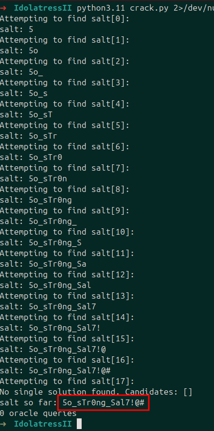
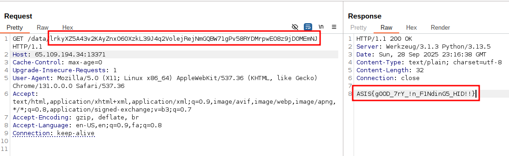

## Twin Oracle

|Category|Difficulty|Score|Solves|First 🩸|
|:-|:-|:-|:-|:-|
|Crypto|Baby 👶|354|6|Brunnerne|

## Code / Description

```
Although you have solved the first part of the Idolatress I challenge, it seems you will face some difficulty http://65.109.194.34:13371 with Idolatress II.

Web ideas mixed with a bit of mathematics are always fascinating!
```

```py
from flask import Flask, Response, abort
from secret import my_encoder, my_decoder, flag


app = Flask(__name__)


@app.route("/")
def index():
	with open(__file__, "r", encoding="utf-8") as f:
		source = f.read()
	return Response(source, mimetype="text/plain")


@app.route("/oracle/<path:value>")
def oracle(value: str):
	if not value.isdigit(): return abort(400, "Bad Value!")
	if int(value) > 2000: return abort(400, "Bad Value!")
	return Response(f"{value} {my_encoder(int(value))}", mimetype="text/plain")


@app.route("/data/<path:value>")
def data(value: str):
	try:
		decoded = my_decoder(value)
		if decoded == 2 ** 313:
			return Response(flag, mimetype="text/plain")
		else:
			return Response(f"{decoded} {value}", mimetype="text/plain")
	except:
		return abort(400, "Bad Value!")


if __name__ == "__main__":
	app.run(host="0.0.0.0", port=5000, debug=True)
```


## Overview


## Challenge Analysis


## Solution







## Final Code


## Flag

```
ASIS{Hashids_iZ_3nc0ding5_NOT_r3AL_HASH!!}
```

## Authors

> [Kourosh Rajabzadeh](https://github.com/KooroshRZ)