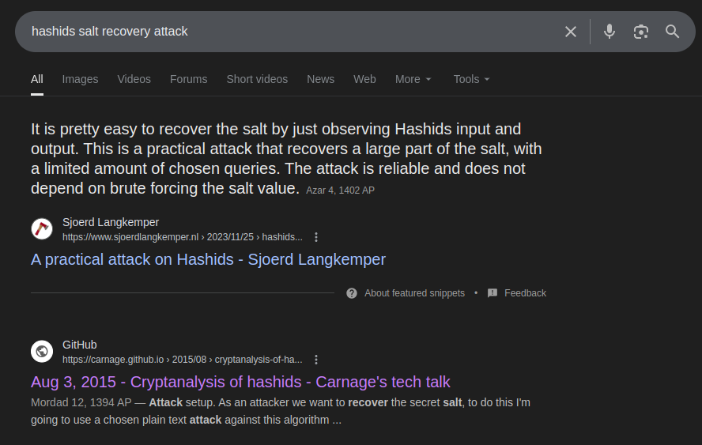
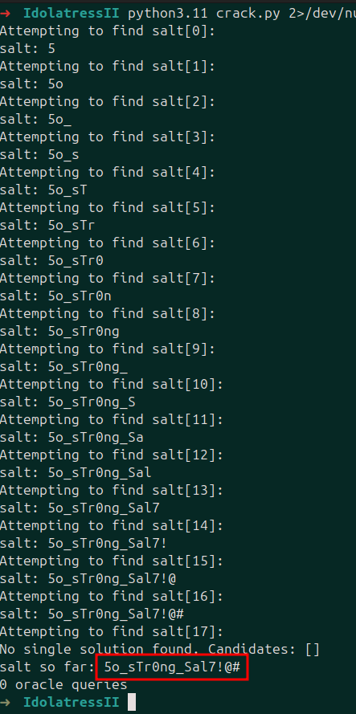
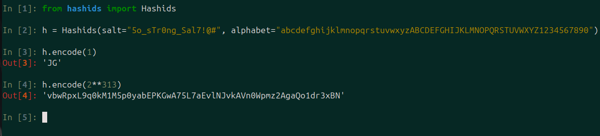

## Idolatress II

|Category|Difficulty|Score|Solves|First 🩸|
|:-|:-|:-|:-|:-|
|Web|Tough Cookie 🥴|354|6|Brunnerne|

## Code / Description

```
Although you have solved the first part of the Idolatress I challenge, it seems you will face some difficulty http://65.109.194.34:13371 with Idolatress II.

Web ideas mixed with a bit of mathematics are always fascinating!
```

```py
from flask import Flask, Response, abort
from secret import my_encoder, my_decoder, flag


app = Flask(__name__)


@app.route("/")
def index():
	with open(__file__, "r", encoding="utf-8") as f:
		source = f.read()
	return Response(source, mimetype="text/plain")


@app.route("/oracle/<path:value>")
def oracle(value: str):
	if not value.isdigit(): return abort(400, "Bad Value!")
	if int(value) > 2000: return abort(400, "Bad Value!")
	return Response(f"{value} {my_encoder(int(value))}", mimetype="text/plain")


@app.route("/data/<path:value>")
def data(value: str):
	try:
		decoded = my_decoder(value)
		if decoded == 2 ** 313:
			return Response(flag, mimetype="text/plain")
		else:
			return Response(f"{decoded} {value}", mimetype="text/plain")
	except:
		return abort(400, "Bad Value!")


if __name__ == "__main__":
	app.run(host="0.0.0.0", port=5000, debug=True)
```


## Overview

This is the second version of the Idolatress challenge, which was about determining the hashids and generating the desired value for number 1. This is a similar challenge with some more difficulties. 
We are supposed to generate the hashids value of $\:2^313\:$ without having the secret salt value.
We need to first crack the salt with an oracle that accepts input less than 2000 and then generate the target hashids for the wanted value.

## Challenge Analysis

Let's look at the source code.

Typical imports and setup:

```py
from flask import Flask, Response, abort
from secret import my_encoder, my_decoder, flag


app = Flask(__name__)

if __name__ == "__main__":
	app.run(host="0.0.0.0", port=5000, debug=True)
```


This function will give us the source code of the challenge

```py
@app.route("/")
def index():
	with open(__file__, "r", encoding="utf-8") as f:
		source = f.read()
	return Response(source, mimetype="text/plain")
```

This is the endpoint where we can generate a hash with a secret salt, but the inputs must be less than 2000:

```py
@app.route("/oracle/<path:value>")
def oracle(value: str):
	if not value.isdigit(): return abort(400, "Bad Value!")
	if int(value) > 2000: return abort(400, "Bad Value!")
	return Response(f"{value} {my_encoder(int(value))}", mimetype="text/plain")
```

And this is where we are supposed to predict the hash value for input $\:2**313\:$ and get the flag.

```py
@app.route("/data/<path:value>")
def data(value: str):
	try:
		decoded = my_decoder(value)
		if decoded == 2 ** 313:
			return Response(flag, mimetype="text/plain")
		else:
			return Response(f"{decoded} {value}", mimetype="text/plain")
	except:
		return abort(400, "Bad Value!")
```
We can generate a hash value for any input through the first endpoint, but it must be less than 2000, and we need to generate a hash value for a number $\:2000\:$ which is much greater than the limit. Additionally, we don't know the secret salt value, so we can not generate the hash easily.

## Solution

Let's first determine the charset and minimum character length value through the first oracle. With some inputs, we can see that the charset required for this setup is alphanumeric (upper case + lower case + numbers), and also, we don't have any weird and long minimum length like the previous challenge, so we only need to pass the charset.
The main part of this hashids setup is its secret salt value. Let's do some research to see if there is a known attack with which we can recover the salt value with some oracle that encodes our optional numbers.



It is obvious that there is a known attack where we can recover the salt with some known hashids. [This link](https://www.sjoerdlangkemper.nl/2023/11/25/hashids-expose-salt-value/) has a great explanation about the attack details and how we can predict and recover the salt values based on the shufflings that are done on optional inputs and their known hash values.
There is also a [python script](https://github.com/Sjord/crack-hashids/blob/main/crackhashids.py) implemented to recover the secret salt value with the oracle, which gives the wanted hash for inputs starting from 1, so we can use it to overcome the 2000 limit.

This is the source code:

```py
from hashids import Hashids

hashids = Hashids("secretsaltysaltines")
oracle_query_count = 0


def encode_oracle(number):
    """
    An encryption oracle. This exposes the hashids from which we determine the secret key.
    """
    global oracle_query_count
    oracle_query_count += 1
    return hashids.encode(number)


def solve_dual_mod(eqs):
    """
    Finds solutions for multiple equations in the form `2 × a = b mod c`.
    """
    results = []
    for i in range(0, 512, 2):  # 2a is always even, and a is in byte range
        matches_all = True
        for val, mod in eqs:
            if i % mod != val:
                matches_all = False
        if matches_all:
            results.append(i // 2)
    return results


def partial_shuffle(string, salt):
    """Reorders `string` according to `salt`."""
    len_salt = len(salt)

    string = list(string)
    index, integer_sum = 0, 0
    for i in range(len(string) - 1, len(string) - len(salt) - 1, -1):
        integer = ord(salt[index])
        integer_sum += integer
        j = (integer + index + integer_sum) % i
        string[i], string[j] = string[j], string[i]
        index = (index + 1) % len_salt
    string = ''.join(string)

    return string


before_first_shuffle = 'abdegjklmnopqrvwxyzABDEGJKLMNOPQRVWXYZ1234567890'  # default alphabet
after_first_shuffle = ''
for i in range(44):
    # First letter is output after shuffling the alphabet once,
    # so by requesting the first 43 letters we obtain the alphabet
    # after it has been shuffled once.
    after_first_shuffle += encode_oracle(i)[0]

# We expect the alphabet to be 43 characters long, and wrap
# on character 44.
if encode_oracle(44)[0] != after_first_shuffle[0]:
    raise RuntimeError("The alphabet length is different than expected.")

salt = ""
for idx in range(0, 42):
    print(f"Attempting to find salt[{idx}]:")
    equations = []

    # first shuffle
    char = after_first_shuffle[-1 - idx]
    intermediate_alphabet = partial_shuffle(before_first_shuffle, salt)
    original_pos = intermediate_alphabet.index(char)
    new_pos = 47 - idx
    integer_sum = sum([ord(c) for c in salt[0:idx]])
    salt_sum = (original_pos - integer_sum - idx) % new_pos
    print(f"{char}: {original_pos} -> {new_pos}")
    print(f"2 x salt[{idx}] = {original_pos} - {integer_sum} - {idx} = {salt_sum} mod {new_pos}")
    equations.append((salt_sum, new_pos))

    # second shuffle
    request = (42 - idx) * 44 + 43
    result = encode_oracle(request)
    print(f"{request} -> {result}")
    lottery = result[0]
    char = result[1]
    intermediate_alphabet = partial_shuffle(after_first_shuffle, lottery + salt)
    original_pos = intermediate_alphabet.index(char)
    new_pos = 43 - idx
    mod = new_pos - 1
    integer_sum = ord(lottery) + sum([ord(c) for c in salt[0:idx]])
    salt_sum = (original_pos - integer_sum - idx - 1) % mod
    print(f"2 x salt[{idx}] = {original_pos} - {integer_sum} - {idx + 1} = {salt_sum} mod {mod}")
    equations.append((salt_sum, mod))

    # combine
    candidates = solve_dual_mod(equations)
    candidates = [c for c in candidates if 32 <= c <= 126]  # assume ASCII
    # candidates = [c for c in candidates if 48 <= c <= 122]  # assume alphanumeric

    if len(candidates) == 1:
        salt += chr(candidates[0])
        print(f"salt: {salt}")
    else:
        print(f"No single solution found. Candidates: {candidates}")
        print(f"salt so far: {salt}")
        break

print(f"{oracle_query_count} oracle queries")
```

We only need to change this part, which acts like the oracle.

```py
def encode_oracle(number):
    """
    An encryption oracle. This exposes the hashids from which we determine the secret key.
    """
    global oracle_query_count
    oracle_query_count += 1
    return hashids.encode(number)
```

This is the Oracle implementation we need to send a request to the server and get the hash value for the input

```py
def encode_oracle(number):
    """
    An encryption oracle. This exposes the hashids from which we determine the secret key.
    """
    data = requests.get(f"http://65.109.194.34:13371/oracle/{number}").text.split()
    return data[1]
```

After running the code, we can see that we successfully recovered the secret salt:




Now we can confirm the salt by generating hash value for number 1. Then we need to generate value for `2**313`



After sending the generated hash value, we can obtain the flag. Unfortunately at the time of writing the write-up the server was shut down so I couldn't take a picture of getting the flag, but you can see the flag at the end of this write-up


## Final Code

```py
from hashids import Hashids
import requests

oracle_query_count = 0


def encode_oracle(number):
    """
    An encryption oracle. This exposes the hashids from which we determine the secret key.
    """
    data = requests.get(f"http://65.109.194.34:13371/oracle/{number}").text.split()
    return data[1]


def solve_dual_mod(eqs):
    """
    Finds solutions for multiple equations in the form `2 × a = b mod c`.
    """
    results = []
    for i in range(0, 512, 2):  # 2a is always even, and a is in byte range
        matches_all = True
        for val, mod in eqs:
            if i % mod != val:
                matches_all = False
        if matches_all:
            results.append(i // 2)
    return results


def partial_shuffle(string, salt):
    """Reorders `string` according to `salt`."""
    len_salt = len(salt)

    string = list(string)
    index, integer_sum = 0, 0
    for i in range(len(string) - 1, len(string) - len(salt) - 1, -1):
        integer = ord(salt[index])
        integer_sum += integer
        j = (integer + index + integer_sum) % i
        string[i], string[j] = string[j], string[i]
        index = (index + 1) % len_salt
    string = ''.join(string)

    return string


before_first_shuffle = 'abdegjklmnopqrvwxyzABDEGJKLMNOPQRVWXYZ1234567890'  # default alphabet
after_first_shuffle = ''
for i in range(44):
    # First letter is output after shuffling the alphabet once,
    # so by requesting the first 43 letters we obtain the alphabet
    # after it has been shuffled once.
    after_first_shuffle += encode_oracle(i)[0]

# We expect the alphabet to be 43 characters long, and wrap
# on character 44.
if encode_oracle(44)[0] != after_first_shuffle[0]:
    raise RuntimeError("The alphabet length is different than expected.")

salt = ""
for idx in range(0, 42):
    print(f"Attempting to find salt[{idx}]:")
    equations = []

    # first shuffle
    char = after_first_shuffle[-1 - idx]
    intermediate_alphabet = partial_shuffle(before_first_shuffle, salt)
    original_pos = intermediate_alphabet.index(char)
    new_pos = 47 - idx
    integer_sum = sum([ord(c) for c in salt[0:idx]])
    salt_sum = (original_pos - integer_sum - idx) % new_pos
    # print(f"{char}: {original_pos} -> {new_pos}")
    # print(f"2 x salt[{idx}] = {original_pos} - {integer_sum} - {idx} = {salt_sum} mod {new_pos}")
    equations.append((salt_sum, new_pos))

    # second shuffle
    request = (42 - idx) * 44 + 43
    result = encode_oracle(request)
    # print(f"{request} -> {result}")
    lottery = result[0]
    char = result[1]
    intermediate_alphabet = partial_shuffle(after_first_shuffle, lottery + salt)
    original_pos = intermediate_alphabet.index(char)
    new_pos = 43 - idx
    mod = new_pos - 1
    integer_sum = ord(lottery) + sum([ord(c) for c in salt[0:idx]])
    salt_sum = (original_pos - integer_sum - idx - 1) % mod
    # print(f"2 x salt[{idx}] = {original_pos} - {integer_sum} - {idx + 1} = {salt_sum} mod {mod}")
    equations.append((salt_sum, mod))

    # combine
    candidates = solve_dual_mod(equations)
    candidates = [c for c in candidates if 32 <= c <= 126]  # assume ASCII
    # candidates = [c for c in candidates if 48 <= c <= 122]  # assume alphanumeric

    if len(candidates) == 1:
        salt += chr(candidates[0])
        print(f"salt: {salt}")
    else:
        print(f"No single solution found. Candidates: {candidates}")
        print(f"salt so far: {salt}")
        break

print(f"{oracle_query_count} oracle queries")
```


## Flag

```
ASIS{Hashids_iZ_3nc0ding5_NOT_r3AL_HASH!!}
```

## Authors

> [Kourosh Rajabzadeh](https://github.com/KooroshRZ)